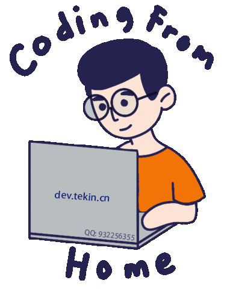

<h2> hi, I'm Tekin Tian!  <a href="https://github.com/tekintian/tekintian/blob/main/README-zh.md" target="_blank"></a></h2>


<p><em>Hi, I am TekinTian, a senior full stack software engineer from Yunnan, China with over 10 years of research and development experience. 
</em></p>
 
   

 

 
###  A little more about me...  

```javascript
const Tekin = {
    pronouns: "He" | "Him",
    code: ["Java", "PHP", "GoLang", "Python", "C/C++", "Javascript", "VueJs", "Flutter"],
    askMeAbout: ["web dev", "tech", "app dev", "weixin miniapp", "desktop app", "Chrome Extenssion"],
    technologies: {
        backEnd: ["Java", "PHP", "GoLang", "Python", "C/C++"],
        frontEnd: ["vue", "html5", "js", "qt", "uniapp", "Chrome Extenssion"],
        mobileApp: ["uniapp", "Flutter", "Android Native"],
        devOps: ["Docker🐳", "K8S", "K3S", "AliYun", "Nginx"],
        databases: ["MySql", "MongoDb", "Oracle", "SqlServer"],
        misc: ["HyperLedger", "Spring", "Nacos", "dubbo", "laravel", "tp"]
    },
    architecture: ["Serverless Architecture", "Progressive web applications", "Single page applications"],
    currentFocus: "No Focus point at this time",
    funFact: "There are two ways to write error-free programs; only the third one works"
};
```

 <em><b>I love connecting with different people</b> so if you want to say <b>hi, I'll be happy to meet you more!</b> 😊</em>


<a href="https://calendly.com/tekintian/30min" target="_blank"></a>

---
<!--START_SECTION:waka-->


**🐱 My GitHub Data** 

> 📦 2.6 MB Used in GitHub's Storage 
 > 
> 🏆 12 Contributions in the Year 2024
 > 
> 💼 Opted to Hire
 > 
> 📜 728 Public Repositories 
 > 
> 🔑 2 Private Repositories 
 > 
**I'm a Night 🦉** 

```text
🌞 Morning                207 commits         ████░░░░░░░░░░░░░░░░░░░░░   15.72 % 
🌆 Daytime                415 commits         ████████░░░░░░░░░░░░░░░░░   31.51 % 
🌃 Evening                537 commits         ██████████░░░░░░░░░░░░░░░   40.77 % 
🌙 Night                  158 commits         ███░░░░░░░░░░░░░░░░░░░░░░   12.00 % 
```
📅 **I'm Most Productive on Sunday** 

```text
Monday                   171 commits         ███░░░░░░░░░░░░░░░░░░░░░░   12.98 % 
Tuesday                  160 commits         ███░░░░░░░░░░░░░░░░░░░░░░   12.15 % 
Wednesday                230 commits         ████░░░░░░░░░░░░░░░░░░░░░   17.46 % 
Thursday                 167 commits         ███░░░░░░░░░░░░░░░░░░░░░░   12.68 % 
Friday                   148 commits         ███░░░░░░░░░░░░░░░░░░░░░░   11.24 % 
Saturday                 203 commits         ████░░░░░░░░░░░░░░░░░░░░░   15.41 % 
Sunday                   238 commits         █████░░░░░░░░░░░░░░░░░░░░   18.07 % 
```


📊 **This Week I Spent My Time On** 

```text
🕑︎ Time Zone: Asia/Shanghai

💬 Programming Languages: 
No Activity Tracked This Week

🔥 Editors: 
No Activity Tracked This Week

🐱‍💻 Projects: 
No Activity Tracked This Week

💻 Operating System: 
No Activity Tracked This Week
```

**I Mostly Code in PHP** 

```text
PHP                      31 repos            ██████░░░░░░░░░░░░░░░░░░░   24.22 % 
Java                     24 repos            █████░░░░░░░░░░░░░░░░░░░░   18.75 % 
Shell                    14 repos            ███░░░░░░░░░░░░░░░░░░░░░░   10.94 % 
JavaScript               12 repos            ██░░░░░░░░░░░░░░░░░░░░░░░   09.38 % 
Go                       10 repos            ██░░░░░░░░░░░░░░░░░░░░░░░   07.81 % 
```


**Timeline**


 Last Updated on 2024-02-16 00:34:01 UTC
<!--END_SECTION:waka-->

**These Readme stats are generated using github action [awesome-readme-stats](https://github.com/cxsw/waka-readme-stats)**

NOTE: Top languages does not indicate my skill level or anything like that. It is just a metric of which languages have been hosted by me on GitHub based on the usage across repositories. There are others which I haven't put up on GitHub.
